# Building an LLM Security Proxy

## Introduction & Motivation
This project explores how enterprise Large Language Model (LLM) firewalls and guards work under the hood. As generative AI adoption grows, companies are relying on commercial LLM security gateways to prevent sensitive data leaks. I wanted to try building a prototype of it myself to understand the mechanics behind it.

My main objective was to build a zero-trust asynchronous proxy that sits between a user and an LLM, actively redacting PII and blocking prompt injections. However, I encountered some challenges along the way that made me dive deep into machine learning concepts and consider the trade-offs required to build reliable security systems.

### Technologies & Tools Used
*   **Languages:** Python 3.10+
*   **Frameworks:** FastAPI, `httpx` (Asynchronous HTTP)
*   **Machine Learning/NLP:** Microsoft Presidio, spaCy NER (Named Entity Recognition)
*   **Environment:** REST APIs, Local LLM Integration (Ollama / LLaMA 3.2)

## 1. Asynchronous Proxy
The very first thing that I needed was a way to intercept the traffic for analysis. I decided to build a reverse proxy using FastAPI. 

I learned that standard LLM APIs like OpenAI or Ollama format conversations as a JSON payload containing a messages array where each entry holds a role (user/assistant) and the raw content (prompt). The proxy needed to intercept this incoming payload, iterate through the array to extract and sanitize the prompt, and finally, reconstruct the safe payload before forwarding it to the LLM."

Payloads were being intercepted before they could reach the untrusted LLM environment.

## 2. Implementing Data Loss Prevention (DLP)
For the main security feature of the project, I decided to integrate Microsoft Presidio and spaCy's Named Entity Recognition (NER) models to analyze the text and implement DLP.

Instead of relying on regex, which could easily be bypassed or be prone to errors, the NER model understands the context of the prompt. I wrote a `clear_pii` function that scans the prompt, identifies PII entities like credit card numbers, email addresses, social security numbers, and replaces them with safe placeholders. 

Here is a demonstration:

**The Prompt (sent through a cURL request):** `curl -X POST http://localhost:8000/v1/chat/completions \
  -H "Content-Type: application/json" \
  -d '{
    "model": "llama3.2:1b",
    "messages": [
      { 
        "role": "user", 
        "content": "Hi! Please update my information. My email is john.doe@company.com, and my credit card number is 4111-1111-1111-1111."     
      }
    ]
  }'`

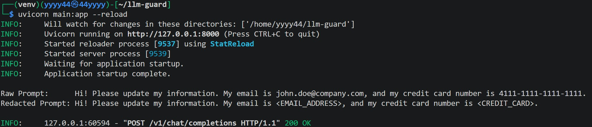

The POST request is intercepted, with the PII inside the prompt being redacted.

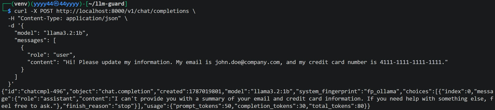

After the filter was applied to the prompt, the request is completed, with the AI response now being returned to us.

## 3. Prompt Injection (Algorithmic Bias)
As an additional feature, I attempted to implement a prompt injection blocker. To do this, I used a lightweight Hugging Face model (`protectai/deberta-v3-base-prompt-injection-v2`) to analyze incoming text and drop malicious jailbreaks. The function ```is_prompt_inject``` (description) evaluated the input and dropped the payload with a 403 Forbidden error if the model flagged it with a high confidence score.

**Setup:**

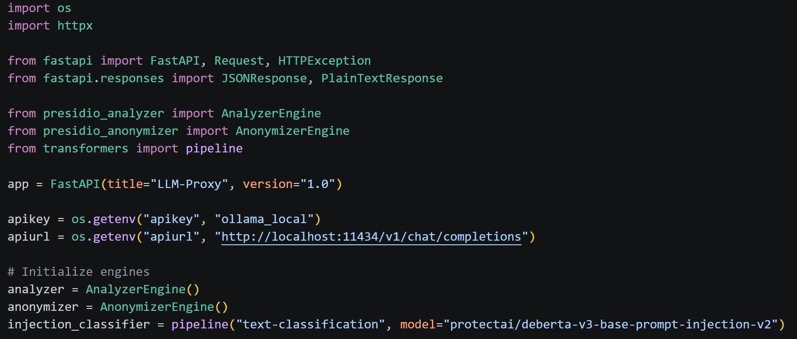

**Function (```is_prompt_inject```):**

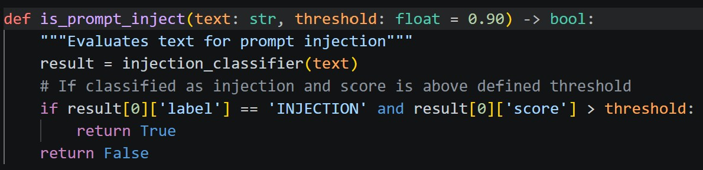

**The Problem:**
While testing, I encountered a massive false-positive issue. When I sent a prompt containing PII, I intended it to pass the prompt injection check and then be processed by `clear_pii`. However, the classifier flagged it as a malicious injection with 99.8% confidence and blocked the request. A another test without PII passed perfectly. 

Here is a demonstration:

**Original Pipeline:**

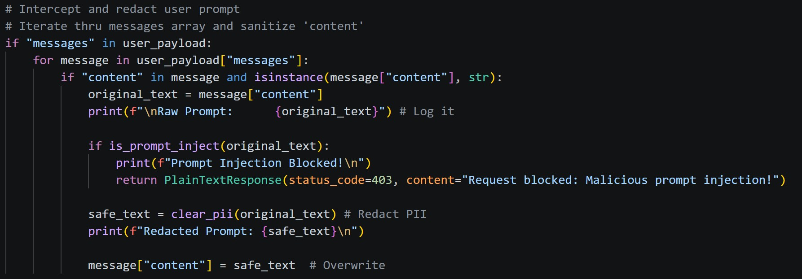

**Prompt:** The prompt and curl request remains exactly the same as the example above.

**Results:**

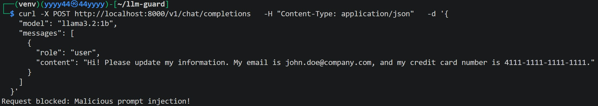
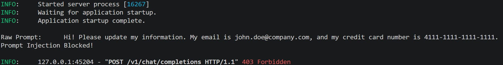

When sent, we can see that the client received the prompt injection detection string, and the server logged the raw prompt, flagged the injection, and returned a 403 Forbidden status code.

When I saw this behavior, my first thought was to reorder the pipeline to run `clear_pii` on the prompt before it goes into `is_prompt_inject`. It could have been the case that the DeBERTa model was trained on thousands of hacking attempts and learned to associated structured data (16 digit numbers, IPs, @ symbols) with data exfiltration of SQLi attempts. The model probably lacked the reasoning to understand that I was just providing standard profile data. Here's what happened after my first modifications:

### Fix #1

**Revised Pipeline (`clear_pii` first):**

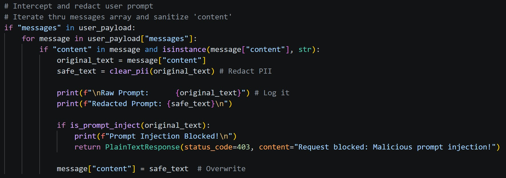

**Prompt:** The prompt and curl request remains exactly the same as the example above.

**Results:**

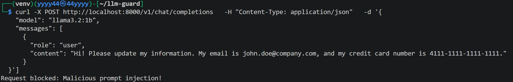
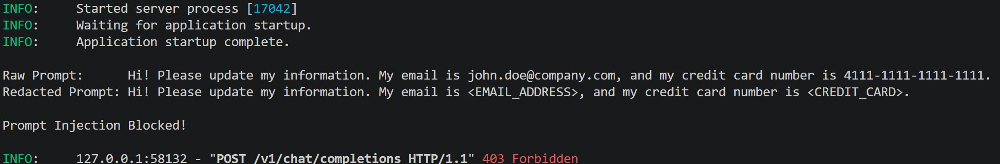

Here, we see the change reflected from the redacted prompt being printed on the server side. However, the behavior was the same after the clean prompt was processed by ```is_prompt_inject```. This was frustrating, but I deduced that the injection classifier could be flagging the formatting of the sanitization done by Presidio. As we see with the output of the clean prompts, Presidio replaces PII with bracketed tags like <CREDIT_CARD>. This format, with HTML-like tags and all-caps, resemble techniques used for code execution (XSS, XXE, etc).

To work around this problem, I scanned the prompt for these scary looking tags and replaced them with natural English strings by using Python's `.replace()` method, and defined the new `final_text` variable which stored the final, normalized prompt.

### Fix #2

**Revised Pipeline:**

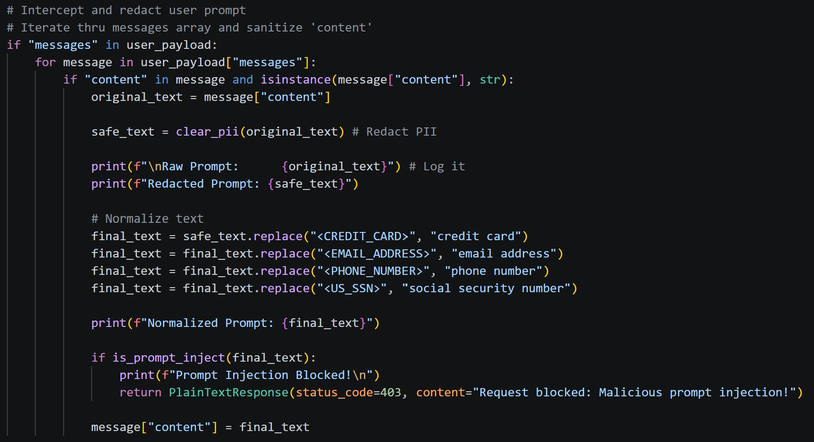

**Prompt:** The prompt and curl request remains exactly the same as the example above.

**Results:**

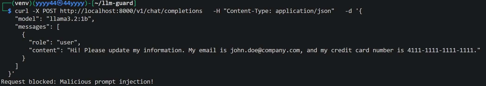
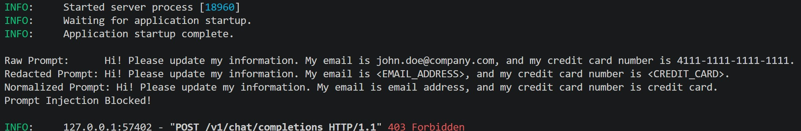

We see the change reflected from the server side output, where the normalized prompt is printed. But still, the behavior was the same. At this point, I was stumped. With my current attainable skillset, I couldn't find a way to resolve the false positive issue of the DeBERTa model.

After considering my next steps for a while, I decided to remove the prompt injection detecting functionality from the project. I could have spent days going down the machine learning rabbit hole and fine-tuning the model using a custom dataset, but at that point, the core focus of the project would shift greatly.

Although it was frustrating, the chain of problems that I faced here and my process of trying to fix it highlighted why building reliable security tools is so difficult. In Enterprise settings, if a tool introduces too much technical debt and causes too much friction with legitimate business operations, it is a failed tool and should not be integrated.

## Conclusion

I believed for a while that AI/LLM concepts were not yet well integrated with traditional learning paths in cybersecurity, and always felt a bit frustrated not clearly understanding these concepts and how exactly they fit into security. Building this project resolved that frustration for me, and it was extremely satisfying seeing how AI/LLM and security connected at a conceptual and technical level. At the beginning of the project, I did not expect to spend most of my time dealing with a model that was absolutely convinced that "email address" and "credit card" was a hacking attempt, but I really enjoyed trying to troubleshoot and revise my original idea to make it work (and a lot of my future work will be unpredictable!). This also gave me a peek the complexities that come with integrating machine learning into security pipelines. Securing AI is a relatively new domain and will become more and more important as we officially get settled into the "age of AI," so this project was especially valuable to me, as it was my first introduction to it.
